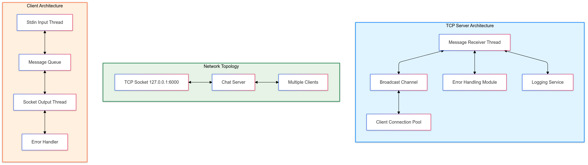

# Realtime Minimal Chat App

## Overview

A simple real-time chat application using TCP sockets in Rust, supporting multiple concurrent clients.

---

## Prerequisites

- Rust (latest stable version)
- Cargo package manager

---

## Project Structure

- `src/server.rs`: TCP server implementation
- `src/client.rs`: TCP client implementation
- `Cargo.toml`: Project configuration

---

## Running the Application

To start the app, you can download the ZIP of released version [here](https://github.com/ahsanzizan/rust-realtime-chat/releases/download/v1.0.0/chat-app-release.rar). Then extract it to get a folder that contains `server.exe` and `client.exe`

### Start the Server First

```bash
./chat-app-release/server.exe
```

### Start Clients

In separate terminal windows, run:

```bash
./chat-app-release/client.exe
```

## Usage

- Type messages in the client terminal
- Messages are broadcast to all connected clients
- Type `:quit` to exit the client

---

## Features

- Concurrent client handling
- Non-blocking I/O
- Simple broadcast messaging
- Error handling

---

## Topology



Details:

### Server Components

- **Message Receiver Thread**: Handles incoming client messages
- **Broadcast Channel**: Distributes messages to connected clients
- **Client Connection Pool**: Manages active client connections
- **Error Handling Module**: Manages network and communication errors
- **Logging Service**: Tracks server events and connections

### Client Components

- **Stdin Input Thread**: Captures user input
- **Socket Output Thread**: Sends messages to server
- **Message Queue**: Buffers messages between threads
- **Error Handler**: Manages connection and communication errors

### Network Configuration

- **Protocol**: TCP
- **Host**: Localhost (127.0.0.1)
- **Port**: 6000
- **Connection Type**: Non-blocking, Concurrent

### Key Communication Patterns

1. Multithreaded message handling
2. Broadcast messaging
3. Non-blocking I/O
4. Graceful error management

---

## Network Details

- Localhost: 127.0.0.1
- Port: 6000

---

## Limitations

- No persistent message storage
- Basic error handling
- No authentication

---

## License

MIT License
